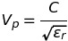
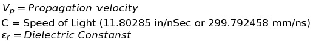
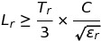
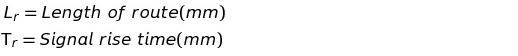

High Speed Design Notes
=======================
__DISCLAIMER__: Use what you find here at your own risk, I'm just trying to be helpful. None of this is set in stone, take what you can from here and make your own style.

__This document is currently in a work in progress.__

This document contains information and tip and tricks about hardware design including schematic, placement, layout, documentation etc. These are the things I learned while working with high speed digital design. I found these from various places on the interwebs, magazines and reference manuals, etc.

# Table of Contents

- [General Information](#general)
- [What is High Speed](#high-speed)
- [Component Tips](#components)
- [Schematics Tips](#schematics)
- [Placement Tips](#placement)
- [Layout Tips](#layout)
- [Silkscreen Tips](#silkscreen)
- [Misc Tips](#misc)
- [Resources](#resources)

# General

__Tip__: Always maintain projects with revision control software.

__Tip__: Always include version number in project name and associated files.

__Tip__: Keep grids across the document consistent, in metric or imperial. Meaning don't use metric for placement and imperial for layout.

__Tip__: Invest time to learn and use the capabilities of CAD tool you are using.

__Tip__: If not 100% sure if part of circuit will work, add an optional components, like 0ohm resistor and a bypass circuit.

__INFO__: a "mil" is one-thousandth of an inch. MIL is also used by some as short for millimeter. Clear it up with whom you are working with.

### __SI UNITS__

| PREFIX | SYMBOL | VALUE             |
| ------ | ------ | ----------------- |
| tera   | T      | 1 000 000 000 000 |
| giga   | G      | 1 000 000 000     |
| mega   | M      | 1 000 000         |
| kilo   | k      | 1 000             |
|        | (none) | 1                 | 
| milli  | m      | .001              |
| micro  | u      | .000 001          |
| nano   | n      | .000 000 001      |
| pico   | p      | .000 000 000 001  |

For usage refer: Guide to the SI, with a focus on usage and unit conversions: (http://physics.nist.gov/cuu/pdf/sp811.pdf)

### Project Tree
 - Project_Name
   - CAD/
   - Hardware/
     - KiCad_Project_Folder/
        - 3D renders/
        - Footprints.pretty/
        - Gerbers/
        - KiCad_Project.sch
        - KiCad_Project.kicad_pcb
        - KiCad_Project.lib
        - BOM.xls
     - Data-sheets/ (also contains app notes)
   - Software/
     - Firmware/
       - Tests/
       - Project firmware/
     - App/  (if any)

# High Speed

__INFO__: What is high speed design? The design that included devices with fast edges. Device switches so quickly that the transition is complete before the signal can travel the other device through the trace. In this case the signal can have reflections and degrade the original signal.  Think of traces as transmission lines.
Technical definition of high speed design: When the round trip time of the signal is equal to or longer than the rise time of the signal, now signal integrity is in doubt and this makes your design is a high speed design.
In high speed signals, energy is concentrated on the edge of the trace called the skin effect. So now the property of the material surrounding the trace dictates how fast the signal can move.

Impedance matching, high quality return path and vias are the three edges of the triangle that contain the problems with high speed design.

__INFO__: An important point to keep in mind, the return path is through the closest power plane, which might not be a ground plane. If the return path is through a power plane instead of a ground plane, then the return energy will ultimately get to ground through the decoupling capacitors that are closest to the source and target pins. If you are relying on a power plane to provide the return path, carefully consider the location of the decoupling capacitors (also referred as stitching caps) near these pins to minimize the size of any loop created.

__Rule of thumb__: The 1/3 Rise time rule. This states if the route is more than 1/3 of the rise time, signal reflections can occur. For example 1nS rise time route longer than 0.33nS (2 inches in FR4) will have problems.

Assuming the Dielectric Constant eR of FR4 is 4, the Velocity of a Signal in FR4 is given as:

Vp(FR4) = (299.792458 / v4) mm/ns
        =149.89 mm/ns (approx. 6 inches/ns)
1nS Rise Time => 0.33nS route => Route Length => 149.89 * 0.33 = 49.46mm(1.98 inches)

Transmission effect will start when below condition is true.

For FR4, the route length at which transmission line effects need to be considered can be calculated as:

LR = TR × 49.965 mm

If TR = 1nS

LR ˜ 50mm (2 inches)

If TR = 100pS

LR ˜ 5mm (0.2 inches)!! On a board with signals switching at these speeds, most routes will be transmission lines.

Sometimes is not always possible to have route lengths shorter than the calculated. So signal reflections will be present, now we have to minimize the reflected energy. That done by impedance matching. Transmission lines have property, when they are terminated by an impedance equal to their own, no energy is reflected back.

__Impedance Matching__:
Impedance is governed by the trace height, width and the dielectric of the material surrounding the trace i.e. air(top/bottom layer) or fr4(inner layers). For a trace to be a transmission line, the adjacent layer must be a plane. By carefully arranging layer stack up, dimensions and properties can be calculated and a specific impedance can be achieved. By keeping the target impedance constant, dimensions and properties are modified to achieve that target impedance. This is called controlled impedance routing.

__Differential Pair__:
Differential pairs provide strong immunity to noise and reduce the reliance on a high-quality return path via a plane. This reduced reliance on a ground plane is directly related to the degree that the pair lengths are matched and remain consistently coupled - as the length matching or the coupling declines, then the reliance of the signals on the plane increases. Most experts agree that matching the length is the critical requirement for differential pairs.

__Vias__: Vias appear as capacitive and inductive discontinuity in the signal path. So the impedance of the signal is affected. Use uVias. Avoid stubs in via, if not avoidable, use back drilling (increased PCB fab cost). But avoid stubs at all costs, they are a major source of signal reflection. __Use octagonal vias to have maximum clearance.__
Stitching vias for high speed signals to have low impedance return path.

__Tip__: Reduce cross talk. Rule of thumb is to keep potential aggressors (CLKs) at least three times the trace width away (centre to centre) from victim trace. This rule is referred to as 3-W rule. Program is rule in CAD if allowed.

# Components

 - Try using 1% resistors rather than 5%. Price is almost same. 1% Board will be more stable in high temp environment than using 5%.
 - Before adding any part in the schematic, check the supplier website.
 - Use through hole connectors, SMD connectors have comparatively low life of operation.
 - __Use__ slightly __different foot prints for resistor and capacitor for same size__ e.g. 0805.

# Schematics

 - Circuit should have a smooth __flow from left to right and top to bottom.__
 - Try to __design circuit in functional blocks__, and place a text for the box. Use net labels fly wires for connecting one block to other.
 - Use below reference designators for various symbols.
   - IC: IC or U
   - Resistor: R
   - Capacitor: C
   - Inductor: L
   - Transistor: Q
   - Diode/LED: D
   - Crystal: Y/XTAL
   - Pin headers: J
   - Jumper: JP
   - Fuse: F
   - Ferrite Bead: FB
   - Fiducial: FD
   - Test point: TP
 - __Add cover page__ for schematic and add following to it.
   - Project name, date, and re/version number. All the names of schematics, notes legend, company information.
   - Schematic status with date (Draft, Preliminary, Checked, Released)

      __Draft__: Blocks, just the structure of the schematic.

      __Preliminary__: Connections done, Quiet close to final.

      __Checked__: No mistakes in schematic.

      __Released__: PCB sent for fab.

 - Add separate sheet for revision history.
 - __Don't connect 4 wires at one junction.__ A junction must three segments connected to them.
 - Avoid too much use of net labels for fly wires. Circuit connected with wires is more readable.
 - Use net labels so that they can used for creating net classes
 - Place all labels, designators, pins, __text etc. horizontally.__
 - Don't try to fill up the whole sheet. Have some breathing room
 - Name schematics with clear and short name. (Avoid CPU1 CPU2, instead use CPU_HDMI CPU_LVDS etc.) On power supply schematic include the voltage levels
 - Fill information in Title block.
 - Distinctly name the title of the schematic, don't use something like "Amplifier"
 - Include voltage value on all power net names. e.g. +3.3_V_REG, +1.2_VCC_DDR. __Never use "Vcc" as net name__

 - Add in design notes on the schematic.

 - If approval from client is needed for one or two extra part, just add it. It can be removed later. Don't keep waiting for approval.

 - Check and double __check RX TX pins connections__ between two components in schematics.
 - Add net labels on important connections, even if its a short wire on schematic.
 - Add test points, must for all power rails, on power control signals, on interfaces of rarely programmables chips(eg memory).
 -  Place components in the schematic close to the pins where they should be located on PCB
 - Generate PDF of the completed schematic.
 - Refer this: https://electronics.stackexchange.com/questions/28251/rules-and-guidelines-for-drawing-good-schematics
 - Simulate parts of the circuit if needed using your favorite simulation software. But never trust the simulation software a 100%, breadboard the circuit before it goes on the schematic.

# Placement

 - Keep in mind the manufacturing technology that will be used, and place components accordingly to avoid solder bridges especially in wave soldering method.
 - Give this a read (http://frontdoor.biz/HowToPCB/HowToPCB-Place.html)
 - Plan you layout first, then start placement.
 - Start with big/main/critical components first like MCU, clock devices, then place resistors and capacitors etc.
 - If board has a predefined location of components e.g. daughter/mother board connectors, place them first.
 - Use 50mil or 100mil grid for TH components and TH/SMD IC. Use 25mill for SMD resistor/capacitors and other small passive components.
 - Isolate analog and digital power supply section.
 - Place clock driver close to clock oscillator.
 - Arrange components in rows and columns and with uniform orientation (for diodes, polarized capacitors).
 - Indicate polarity on silk screen, keeping mind the polarity indication doesn't overlap with adjacent components. It should be possible to find the polarity after assembly.
 - Place all components on top side of the PCB. On complex designs place short height and/or low thermal dissipation components go on bottom, never place tall components on the bottom side else it will increase the total height of the PCB.
 - Keep 40 mil space between components and 100mill to 120mil from component to edge
 - Place bypass caps as close to IC as possible, use combination of 10uF and 100nF, place smaller cap closer to IC.
 - Place connectors on one edge of the board.
 - Place LEDs, TP, switches, jumpers and other, SDA (set during assembly) components so that it’s easy to access.
 - Place power supply, components high current traces first.
 - Check if the placement agrees with the layout plan.
 - Place four mounting holes.
 - Make sure enough space around mounting holes for screw heads to sit on and try placing big components around PCB.
 - Keep more space around headers pins/connectors. Learn from arduino's mistake on placing ISP of 168p too close to Arduino headers. There is no space for screw head on mount hole near USB connector.
 - Use stands off components for connectors  like mPCIe card, so that components can be placed under the card to save the space on PCB.
 - Place hot components on the top side of the PCB.
 - Must place test points on all power nets and optional critical signals and programming pins if needed.
 - Place fiducial on corners of board, if space is not available in corner, place it under any through hole component, as the the fiducial will not be covered as through component are assembled after SMD.

# Layout
 - __Plan your layout__ first before starting.
 - Start routing with thicker traces and at end of layout change back to thinner track, this will increase the gap between tracks and also decrease the cross talk.
 - Start with long route lengths and then route short ones.
 - For two layer PCB route signal track on only single layer, route short signals on other layer if necessary.
 - __Create board variants__ of PCB design if CAD allows it.
 - __Use__ optional __resistor to re-route signal to different interfaces__ or connectors
 - Have __exactly same pins on symbols as on foot print part__. Draw all pins even if a group of pins connects to same net.
 - __via aspect ratio__: find minimum drill size and via aspect ratio from fab. E.g. 1:12 means 0.1mm holes max thickness of board (or max drill depth) is 1.2mm. So 0.1 mm hole/via will not work for 1.6mm PCB. For micro via e.g. 1:1 means 0.1mm hole, max depth will be 0.1mm, find layer to layer distance from fab and draw appropriate uVia.
 - __The minimum space between conductors is determined by the PEAK VOLTAGE difference__

 - __Appropriate Trace Width is determined by the CURRENT requirement and acceptable TEMPERATURE RISE__
 - __Always ALWAYS think about return current for high speed signals__
 - For BGA, __fan out all pins routes__ just outside the package and place all the vias before starting any routing the board.
 - __Never use auto router__, not even for small section of PCB.
 - __Never split ground planes__ (from mixed signals article issue June 2001 Printed Circuit design & circuits assembly design magazine), it will cause EMC problems by creating a dipole antenna. Use virtual partition in layout, separate the analog and digital sections. Don't create voids in planes either, it creates an antenna.
 - __Place analog circuit in a corner__ of board, so it will not interfere with high speed/current traces.
 - Read PCB Design Guidelines For Reduced EMI - Texas Instruments (www.ti.com/lit/an/szza009/szza009.pdf)
 - Read 6 pillars of DfMA article in 03-16 issue of Printed Circuit design & circuits assembly design magazine's design practices section, all issue are free to download from magazine's website.
 - Use low ESR __X7R 0604 caps.__
 -  For 4 to 6 PCB layers have 2 to 4 power planes.
 - Clearance: 6 mils
     - Trace width: 6 mils
 - Use __PCB thickness: 1.6mm - 2mm__ (Less than this will cause heating issues leading to potential warp-age.
 - Via hole 0.3
 - __Avoid Stubs__ to prevent signal reflections. (Stubs? http://www.polarinstruments.com/support/si/AP8166.html)
 - Isolate clock and HI-SPEED signal
 - Good article to avoid PCB defects (https://www.linkedin.com/pulse/how-avoid-embedded-pcb-design-defects-lisa-liu-jingwen)
 - __Avoid drawing diagonal trace.__ Layers are in even numbers, use layer pairs and route horizontally on one and vertical traces on other.
 - For multi-layer boards, __keep layer stack up symmetrical__ to avoid board warp-age.
 - __Use stitching Caps__ when signals use power plane as reference for return path to gnd. __Very important__
 - For 2 layer PCB, do not just pour gnd all over the pcb, think about the current flows and return paths. Its good to have one gnd reference plane.
 - For multilayer PCB, add numbers to each layer and offset it, also add copper strips on edge of the board which will be proturded off the pcb edge, the lenght should increase with layer number for better understanding watch this [video](https://www.youtube.com/watch?v=ngIbkh6HKoU)
 
#Silkscreen
 - Place information on silkscreen when space is available.
 - Place pin number/names for headers.
 - Add table if board has variants
 - Add company information and logo.
 - Information about jumper settings
 - Add information for power inputs
 - Add mechanical layer for dimensions of board, mount holes, important connectors etc. add units, and scale.
 - Add manufacture notes, information like file names, pcb thickness, solder-mask colour, silkscreen colour, panalizing info if any.
 - Add license on a separate layer.

### Layout Approach

 Route interfaces from high to low speeds, follow below order (fit in RAM)
 1. PCI Express
 2. USB 3.0
 3. SATA
 4. Ethernet
 5. HDMI
 6. LVDS
 7. USB 2.0
 8. SD/MMC/SDIO
 9. Parallel RGB LCD
 10. Parallel Camera
 11. Digital Audio
 12. VGA
 12. Analog audio, DC
 13. Low speed interfaces (I2C, UART, SPI, CAN, S/PDIF, and GPIO)

### PCB Stack up

Read 6 part article in section 10: http://www.hottconsultants.com/tips.html

#### Typical 4 layer stack up

| Layer        | Type               |
| ------------ | ------------------ |
| Top Layer    | High speed signals |
| Layer 2      | GND plane          |
| Layer 3      | Power plane        |
| Bottom Layer | High speed signals |

It’s recommended to route high speed signal on top rather than bottom, as the signals are directly referenced to ground plane. If high speed signals need to be on the bottom layer, swap power and GND plane.

#### Typical 6 layer stack up
| Layer        | Type               |
| ------------ | ------------------ |
| Top Layer    | High speed signals |
| Layer 2      | Power plane        |
| Layer 3      | Low Speed plane    |
| Layer 4      | Low Speed plane    |
| Layer 5      | GND plane          |
| Bottom Layer | High speed signals |

Again route high speed signals with ground reference plane, in above case, it’s on bottom. Low speed signals do not need impedance matching. Other stack up is to route high speed signals on layer 3 and layer 4.

#### Eight Layer Stack up

| Layer        | Type               |
| ------------ | ------------------ |
| Top layer    | High speed signals |
| Layer 2      | GND plane          |
| Layer 3      | High speed signals |
| Layer 4      | Power plane        |
| Layer 5      | GND plane          |
| Layer 6      | High speed signals |
| Layer 7      | GND plane          |
| Bottom       | High speed signals |

__TODO: edit the stacks up__
Layer 6 for high speed signals with most critical impedance control, next preference layer 1 and 8 for high speed routing.
If needed and if supported do polarity reversal and/or if needed and/or supported do lane reversal on PCIe
Keep all differential signals on the same layer, if layer switch is needed, switch both signals.

__Layer Stack up suggested by Altuim documentation.__

| 4-Layer  | 6-Layer     | 8-Layer     | 10-Layer    | 12-Layer    |
| -------- | ----------- | ----------- | ----------- | ----------- |
|          |             |             |             | Signal HS-H |
|          |             |             | Signal HS-H | GND         |
|          |             | Signal HS-H | GND         | Signal HS-V |
|          | Signal H    | GND         | Signal HS-V | Signal H    |
| Signal V | GND         | Signal HS-V | Signal H    | GND         |
| GND      | Signal HS-V | GND         | GND         | Signal V    |
| Power    | Signal HS-H | Power       | Power       | Signal H    |
| Signal H | Power       | Signal H    | Signal V    | Power       |
|          | Signal V    | GND         | Signal HS-H | Signal V    |
|          |             | Signal V    | GND         | Signal HS-H |
|          |             |             | Signal HS-V | GND         |
|          |             |             |             | Signal HS-V |

## Misc.

 - Do not route high speed traces near the edge of the board and/or edge of reference plane.

 - Keep clocks and high current switching circuits like power supplies away from analog circuits. Also keep distance between traces if digital and analog are running in parallel, to avoid cross talk.

 - Use virtual split between analog and digital grounds, use mechanical layer to draw the split.

 - Use resistor of 22 ohm in series with clock line on MCU.

 - Keep gap between tracks as big as possible where space is available, especially keep more gaps on both sides on clock trace to avoid cross talk.

 - Keep reset signal from away from other signals. Use manufacture's app note to design reset circuit. If this part is not wired correctly, it can lead to unstable board.

 - Always mark pin 1 of connectors on silk screen.

 - Route power track with min 0.4mm thickness.

 ### Rise Time and Length in PCB

 | Logic Type    | Typical Edge speed(nS)Rise/Fall Time | Transition Electrical Length in FR-4(CM) | Critical Length(CM)|
 | ------------- | ------------------------------------ | --------------------------------------- | ------------------ |
 | TTL           | 5                                    | 76.20                                   | 38.10              | 
 | FTTL          | 1.2                                  | 18.29                                   | 9.14               | 
 | 10 K ECL      | 2.5                                  | 38.10                                   | 19.05              | 
 | BTL           | 0.5                                  | 7.62                                    | 3.81               | 
 | LVDS          | 0.3                                  | 4.57                                    | 2.29               | 
 | 100K ECL      | 0.5                                  | 7.76                                    | 3.81               | 
 | GaAs 106      | 0.3                                  | 4.57                                    | 2.29               | 
 | GLT+(PentPro) | 0.3                                  | 4.57                                    | 2.29               | 
 | OC-48         | 0.2                                  | 3.05                                    | 1.52               | 
 | OC-192        | 0.05                                 | 0.76                                    | 0.38               | 

“Transition Electrical Length” lists the electrical length of each of the rise times. The column titled “Critical Length” lists the approximate electrical length at which two transmission lines running in parallel will achieve worst-case backward cross-talk in a PCB.

## DDR3 RAM
Read about Manhattan distance, and topology for connecting ddr3 ram, T topology, and fly by topology.
 - Clock traces must be longer than address and control traces. Add to length design rule.
 - Add matched length rule.

## LAN interface

 - Use LAN port with integrated magnetics.
 - Shield LAN port with adequate GND plane.
 - Differential impedance: 100E
 - Common mode impedance: 50E
 - RX/TX mismatch: must be 0, max 1
 - For Gigabit max trace length: 3-5”
 - No traces under the connector.
 - Network jargon MII, SGMII, RGMII, PHY: http://stackoverflow.com/questions/15777399/clarification-on-ethernet-mii-sgmii-rgmii-and-phy#15777553
 - If PHY is not on SoM, place PHY at least 1” away from connector

## USB interface

 - Differential impedance: 80-100 ohms
 - CM impedance: 45
 - Continuous reference plane under diff pair

## SATA interface

 - Differential pair: 100
 - CM impedance: 60
 - Continuous reference plane under diff pair.
 - Minimum via use.
 - Strong matching not required but recommended

## PCI Express

 - Diff impedance: 100
 - CM impedance: 60
 - Intra pair matching is must, max difference 10mil
 - SD/MMC interface:

# Testing
 - Power the test board from lab power supply with current limiter, if any short is present, it will not let the magic smoke out.
 - If you assembly a prototype if it doesn't work, do not assembly more boards, find and fix the problem found in first board.
 - Create paper model of the board before sending it out to fab.
 - Test your board for ESD before sending out for production.
 
 # Board Release procedure
 - Make sure the footprint match the manufactuer part number.
 - Recheck numbering on tactile switches.
 - Check schematic for any errors.
 - Check DRC in PCB.
 - Inspect gerber files generated.

##  Resources

Various Printed Circuit design & circuits assembly design magazine issues (http://pcdandf.com/pcdesign/)

Robert Feranec tips from YouTube and his courses. (http://www.fedevel.com/academy/)

Webinar and guides on toradex website (https://www.toradex.com/carrier-board-design)

Wiki on Dave’s SoM (http://wiki.dave.eu/index.php/Carrier_board_design_guidelines_(SOM))

Right the first time by Lee W. Ritchey

Ten Rules for Components Placement on PCB Design (http://www.quick-teck.co.uk/TechArticleDoc/13478822401347740338.pdf)

http://frontdoor.biz/HowToPCB/HowToPCB-PageOne.html

Layer Stack up: http://www.hottconsultants.com/tips.html

Altium documentation: http://www.altium.com/documentation/15.1/display/ADES/((High+Speed+Design+in+Altium+Designer))_AD

Equations imported to images from here: http://www.sciweavers.org/free-online-latex-equation-editor

Reference Designators: https://en.wikipedia.org/wiki/Reference_designator
